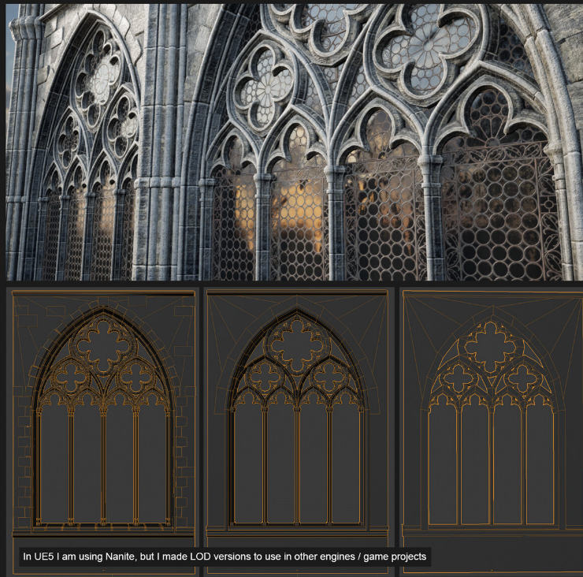
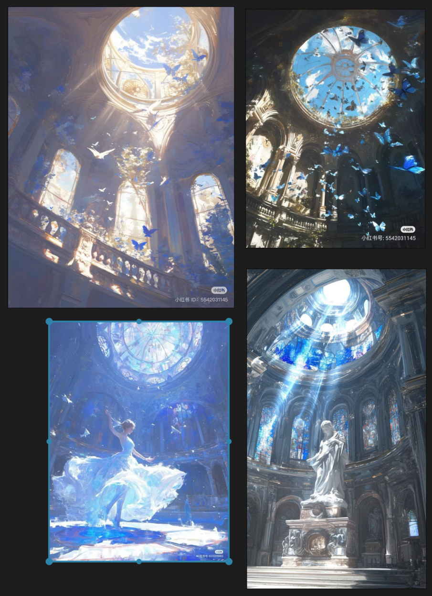
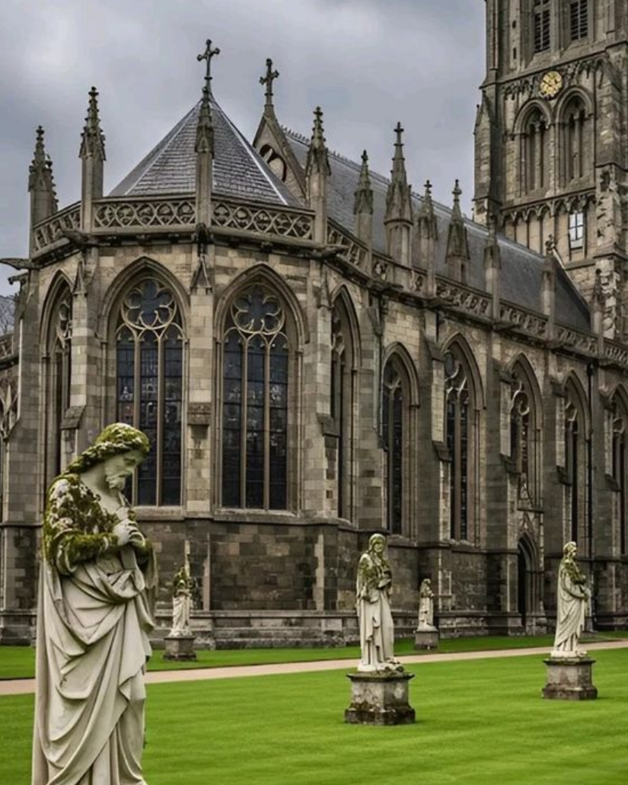
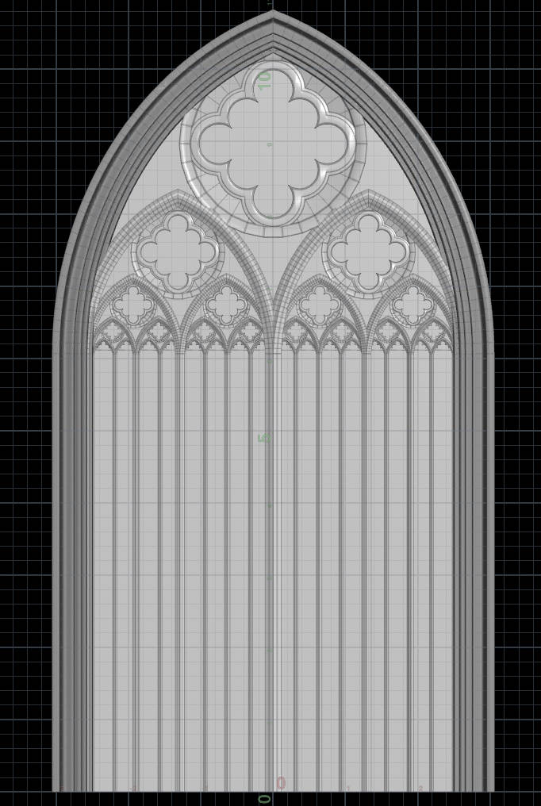
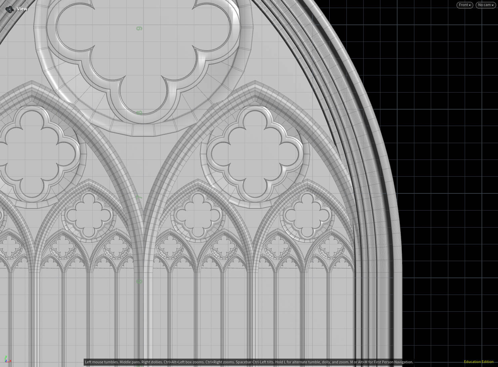
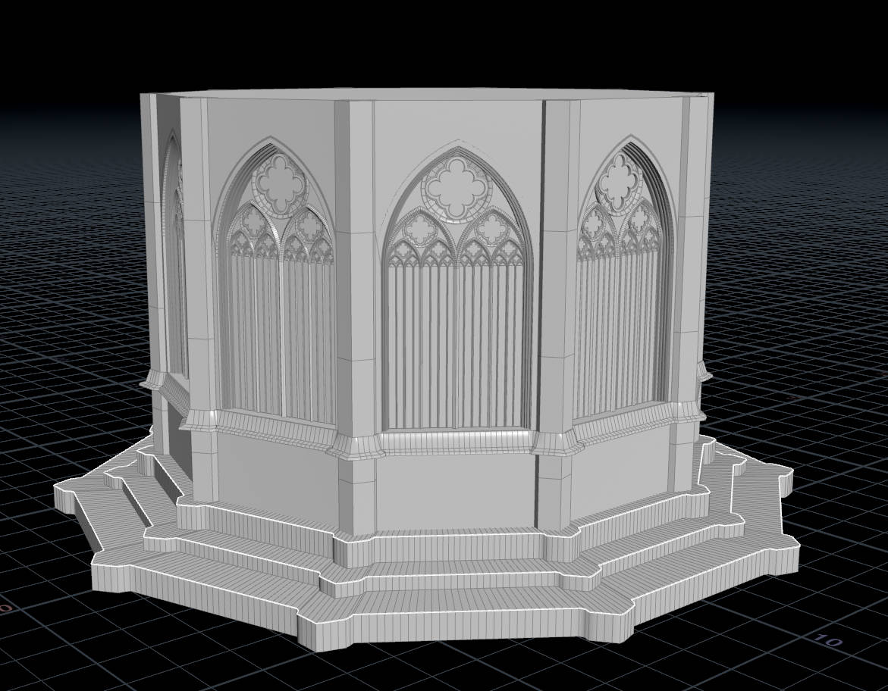

# CIS 5660 HW04 Procedural Buildings
## Pre-Planning

I want to focus on recreate these gothic window structure procedurally, then use that as one facade of a regular polygon shaped, circular-ish cathedral. Building structure wise it is fairly straightforward and not much random placement, but the hard part would be placing the parts exactly where they need to be and follow a rigid structure. The windows are probably the most challenging.

# Results

Video walk through: https://vimeo.com/1134100209/04a2086304?share=copy&fl=sv&fe=ci